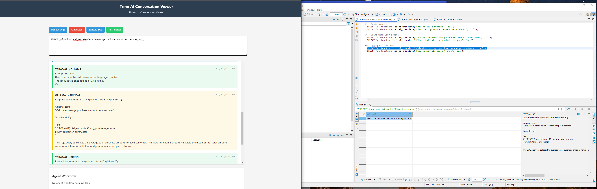
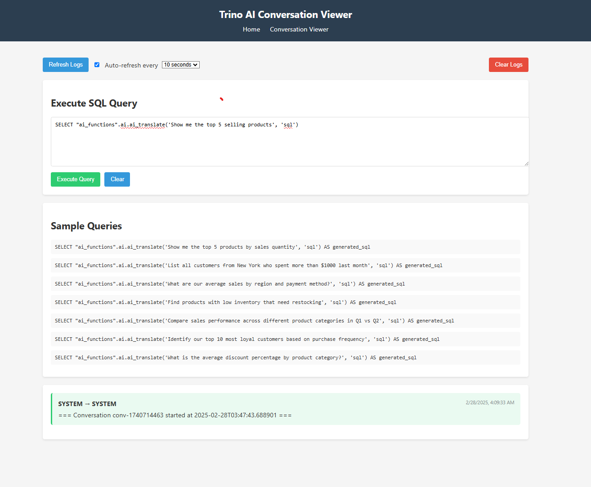

# Trino AI

## Demo

Here's the Trino AI Conversation Viewer interface in action:



The interface provides an SQL query execution area where users can enter natural language queries that get translated to SQL:




Current Status: 
    -Able to run NLQ to SQL translation and return results, need refine the agentic flow and usage of metadata. 
    -Have not tested the system with complex queries/ large datasets yet.
    - Able to run the ai-agent from different trino, looking into  https://github.com/SwanseaUniversityMedical/trino2trino or https://github.com/sajjoseph/trino/tree/add-trino-to-trino-connector for ai-agent flow to return data results over trino-ai-only.
    -Need to add more tests and documentation. 

## Overview

Trino AI bridges the gap between natural language and SQL, allowing business users, analysts, and anyone unfamiliar with SQL to effectively query their Trino data warehouse. By leveraging large language models and a multi-agent architecture, Trino AI translates natural language questions into optimized SQL queries, executes them against your Trino instance, and presents the results in an easy-to-understand format.

## Key Features

- **Natural Language to SQL Translation**: Translate English questions to valid SQL queries
- **Multi-Agent Architecture**: Uses specialized agents (DBA, SQL) to analyze, generate, and optimize queries
- **Schema Awareness**: Automatically identifies and utilizes relevant tables and fields
- **Interactive UI**: Simple web interface for querying and viewing results
- **Context Retention**: Remembers previous queries for follow-up questions
- **Query Validation**: Ensures generated SQL is valid before execution
- **Trino Integration**: Seamlessly connects to your existing Trino infrastructure

## Architecture

Trino AI consists of several components:

- **Web Interface**: Flask-based UI for inputting queries and displaying results
- **Agent Orchestrator**: Coordinates specialized AI agents to analyze and process queries
- **LLM Integration**: Connects to Ollama for language model capabilities
- **Vector Database**: Uses Chroma for semantic search and schema understanding
- **Trino Client**: Executes generated SQL against Trino and retrieves results

## Quick Start

### Prerequisites
- Docker and Docker Compose
- Trino instance (included in Docker setup)

### Installation

1. Clone the repository:
   ```bash
   git clone https://github.com/yourusername/trino-ai.git
   cd trino-ai
   ```

2. Start the Docker containers:
   ```bash
   docker-compose up -d
   ```

3. Access the UI:
   Open your browser and navigate to `http://localhost:5001`

### Configuration

Configure your Trino connection and other settings in the `.env` file:

```
TRINO_HOST=trino
TRINO_PORT=8080
TRINO_USER=admin
TRINO_CATALOG=iceberg
TRINO_SCHEMA=iceberg
OLLAMA_HOST=ollama
OLLAMA_PORT=11434
OLLAMA_MODEL=llama3.2
```

## Usage

1. Enter a natural language query in the input box:
   - "Show me the top 5 selling products"
   - "What's the total revenue by category last month?"
   - "Find customers who made more than 3 purchases"

2. View the generated SQL and results in the interface

3. Ask follow-up questions, as the system maintains conversation context

## Development

### Project Structure

```
trino-ai/
├── agents/                 # AI agents for different tasks
│   ├── dba_agent.py        # Database analysis agent
│   ├── sql_agent.py        # SQL generation agent
├── tools/                  # Tools used by agents
├── static/                 # Web UI files
├── templates/              # HTML templates
├── app.py                  # Main Flask application
├── agent_orchestrator.py   # Coordinates agent activities
├── conversation_logger.py  # Logs all interactions
├── ollama_client.py        # Interface to Ollama LLM
├── trino_client.py         # Interface to Trino database
├── docker-compose.yml      # Docker compose configuration
└── README.md               # Project documentation
```

### Adding New Capabilities

1. Create new agent types in the `agents/` directory
2. Add new tools in the `tools/` directory
3. Register them in the `agent_orchestrator.py` file

## Troubleshooting

- **Connection Issues**: Ensure Trino is running and accessible
- **Model Loading**: Verify Ollama is running and the specified model is available
- **SQL Errors**: Check the logs for details on SQL validation failures


## Acknowledgments

- Trino Project
- Ollama
- HuggingFace for Sentence Transformers

## Socrata ETL Integration

Trino AI now includes a robust ETL solution for loading data from the Socrata Open Data API into Trino. This allows you to easily import public datasets from various government and organizational sources directly into your Trino instance for analysis.

### Features

- **Dataset Discovery**: Automatically discover available datasets from Socrata domains
- **Metadata Extraction**: Extract and store dataset metadata for better organization
- **Schema Organization**: Intelligently organize datasets into appropriate schemas
- **Smart Partitioning**: Partition large datasets for improved query performance
- **Metadata Registry**: Maintain a registry of all imported datasets for easy reference
- **Batch Processing**: Process multiple datasets in a single run
- **Error Handling**: Robust error handling and logging

### Usage

The Socrata ETL process is managed through a set of scripts in the `scripts` directory:

```bash
# Start all necessary services
./scripts/socrata_etl_manager.sh start

# Run the full ETL process (default: data.cityofnewyork.us, limit: 5)
./scripts/socrata_etl_manager.sh run

# Run with custom domain and limit
./scripts/socrata_etl_manager.sh run data.cityofnewyork.us 10

# Load a specific dataset by ID
./scripts/socrata_etl_manager.sh load vx8i-nprf

# Query data in Trino
./scripts/socrata_etl_manager.sh query "SELECT * FROM iceberg.metadata.dataset_registry"

# Check service status
./scripts/socrata_etl_manager.sh status

# Stop all services
./scripts/socrata_etl_manager.sh stop
```

### API Credentials

To use your Socrata API credentials:

1. Copy the example environment file:
   ```bash
   cp data-loader/.env.example data-loader/.env
   ```

2. Edit the `.env` file with your credentials:
   ```
   SOCRATA_APP_TOKEN=your_app_token
   SOCRATA_API_KEY_ID=your_api_key_id
   SOCRATA_API_KEY_SECRET=your_api_key_secret
   ```

3. The `.env` file is excluded from Git, so your credentials will remain local and won't be committed to the repository.

For more detailed information about the Socrata ETL process, see the [data-loader/README.md](data-loader/README.md) file.

## Codebase Cleanup Recommendations

After analyzing the project structure, here are the files and methods that can be cleaned up to streamline the codebase:

### 1. Redundant Files to Remove

The following files have overlapping functionality and can be safely removed:

```bash
# Python files with redundant functionality
data-loader/data_loader.py       # Functionality now in socrata_loader.py and main.py
data-loader/load_dataset.py      # Functionality now in main.py with --dataset argument

# Shell scripts that are no longer needed
scripts/load_nyc_dataset.ps1     # Windows version replaced by load-dataset.bat
view_agent_thinking.sh           # Monitoring functionality in web UI
monitor_agent.sh                 # Monitoring functionality in web UI
```

### 2. Methods to Clean Up in `socrata_loader.py`

The current implementation has several methods that could be improved:

```python
# Redundant method - can combine with _determine_schema_from_metadata
def _determine_table_name(self, metadata):
    # ...

# Potential to simplify this with a mapping table
def _map_socrata_datatype(self, socrata_type):
    # ...
```

### 3. Implementation Plan for Cleanup

Here's how to approach the cleanup:

1. **Verify Script Usage**: Before deletion, check if any scripts are used by other processes:
   ```bash
   grep -r "script_name.sh" .
   ```

2. **Create a Backup**:
   ```bash
   mkdir -p ./backup
   cp data-loader/data_loader.py data-loader/load_dataset.py ./backup/
   cp scripts/load_nyc_dataset.ps1 view_agent_thinking.sh monitor_agent.sh ./backup/
   ```

3. **Remove Redundant Files**:
   ```bash
   rm data-loader/data_loader.py
   rm data-loader/load_dataset.py
   rm scripts/load_nyc_dataset.ps1
   rm view_agent_thinking.sh
   rm monitor_agent.sh
   ```

4. **Simplify the `socrata_loader.py` Code**:
   - Combine `_determine_table_name` with `_determine_schema_from_metadata`
   - Create a lookup table for Socrata data type mapping
   - Improve error handling and logging consistency

### 4. Important Files to KEEP

Make sure to preserve these critical files:

```
socrata_loader.py        # Our main ETL process
main.py                  # Entry point for the application
requirements.txt         # Dependencies
Dockerfile               # Container definition
.env                     # Environment configuration
README.md                # Documentation
load-dataset.bat         # Windows batch file for dataset loading
```

This cleanup will simplify maintenance, reduce confusion about which scripts to use, and make the codebase more maintainable going forward.

